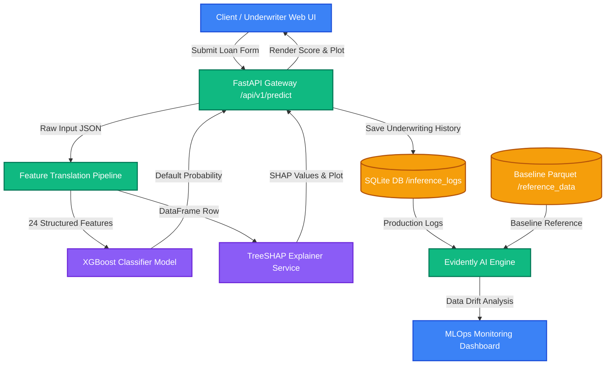

# CreditLens AI — Explainable Credit Scoring & Risk Assessment Platform

[](https://fastapi.tiangolo.com)
[](https://xgboost.readthedocs.io)
[](https://evidentlyai.com)
[](https://github.com/shap/shap)

**CreditLens AI** is an end-to-end, production-ready credit underwriting and scoring platform. It translates complex customer financial data into standard **FICO-style credit scores (300-850)**, makes automated credit decisions, explains its logic using **TreeSHAP**, and monitors model health (Data Drift) using **Evidently AI**.

This project demonstrates software engineering best practices (**Clean Architecture, SOLID, Async I/O**), machine learning excellence (**Optuna Tuning, Stratified 5-Fold CV**), and MLOps principles.

---

## 🏗️ System Architecture

The following diagram illustrates the lifecycle of a loan application, from web form submission to real-time risk scoring, explainability, database logging, and MLOps drift monitoring.



---

## 🌟 Technical Highlights

### 1. Production-Grade Machine Learning Pipeline
*   **Feature Selection Strategy:** Filtered down from 120+ raw variables to **24 high-impact predictors** (financial ratios, external rating sources, payment behavior, and CIC credit counts) to optimize model interpretability and minimize real-time API latency.
*   **Optuna Hyperparameter Tuning:** Automated search of optimal regularizations ($L_1, L_2$), tree depths, and subsample rates using GPU-accelerated training.
*   **Robust CV Strategy:** Evaluated using **Stratified 5-Fold Cross-Validation** to prevent data leakage and handle class imbalance (defaults vs. non-defaults).

### 2. Clean Software Architecture
*   **SOLID Principles:** Strictly decouples database interactions (`repository.py`), data validation schemas (`schemas/`), business logics (`services/`), and endpoints (`api/`).
*   **Offline-to-Online Symmetry:** Shares the exact same `FeaturePipeline` class (`ml/feature_engineering.py`) between offline Jupyter training and the online FastAPI web server, ensuring no feature mismatch bugs.
*   **Async Database Operations:** Utilizes SQLAlchemy AsyncSession for non-blocking I/O operations, ensuring high concurrency under heavy load.

### 3. Explainable AI (XAI) with TreeSHAP
*   Generates local feature contribution explanations for every underwriting decision.
*   Outputs transparent dark-themed **SHAP waterfall plots** matching the modern glassmorphism UI theme, showing underwriters exactly why a credit application was approved or rejected.

### 4. MLOps Data Drift Monitoring
*   Tích hợp **Evidently AI** để tự động so sánh dữ liệu thực tế (Inference logs) với tập dữ liệu baseline của mô hình (`reference_data.parquet`).
*   Computes Population Stability Index (PSI) and p-values (K-S tests, Z-tests) to alert engineers of feature distribution shifts (Data Drift) or model performance degradation (Target Drift).

---

## 📁 Repository Structure

```text
home-credit-score/
├── app/                       # FastAPI Backend Application
│   ├── api/                   # Router endpoints (/predict, /history, /monitoring)
│   ├── database/              # Async SQLite DB connection & ORM Models
│   ├── schemas/               # Pydantic request/response validation schemas
│   ├── services/              # Core business logics (Inference, SHAP, Drift)
│   └── config.py              # Configurations & Environment settings
│
├── ml/                        # Offline ML Modeling & Training Pipelines
│   ├── feature_engineering.py # Shared feature preprocessing & engineering
│   ├── train.py               # Fast local baseline training script
│   ├── evaluate.py            # Model performance evaluation script
│   └── kaggle_unified_train.py# Production tuning code (Optuna, Stratified CV, GPU)
│
├── data/                      # Model weights, reference baseline (gitignored raw data)
│   ├── models/                # Saved xgb_model.json and feature_pipeline.pkl
│   └── reference/             # Saved reference_data.parquet for drift analysis
│
├── static/                    # Frontend Web SPA (HTML, CSS variables, Vanilla JS)
├── tests/                     # Test Suite (Unit & Integration tests)
├── .gitignore                 # Git ignore file (excludes virtualenvs, huge datasets)
├── requirements.txt           # Python library dependencies
└── README.md                  # Project overview & documentation
```

---

## 💻 Installation & Local Setup

### 1. Clone & Environment Setup
Clone the repository and set up a virtual environment:
```bash
# Clone the repository
git clone https://github.com/nvfus12/home-credit-score.git
cd home-credit-score

# Create python virtual environment
python -m venv .venv

# Activate virtual environment (Windows)
.venv\Scripts\activate

# Install required dependencies
pip install -r requirements.txt
```

### 2. Running Local Unit & Integration Tests
Ensure everything works out of the box by running the test suite:
```bash
pytest tests/ -v
```

### 3. Running the Web Application
Launch the FastAPI development server:
```bash
.venv\Scripts\python -m uvicorn app.main:app --reload
```
Open **[http://127.0.0.1:8000](http://127.0.0.1:8000)** in your browser.
*   **Tab 1 (Underwriting):** Select from the **10 preloaded loan profile templates** (ranging from excellent doctors to poor high-risk borrowers) or enter custom parameters to run real-time scoring.
*   **Tab 2 (Evaluation History):** Search and filter past underwriting decisions saved in the SQLite database.
*   **Tab 3 (MLOps Monitoring):** View the live **Evidently AI Data Drift report** showing feature distributions and system stability.

## 📝 License
This project is licensed under the Apache License 2.0. See the `LICENSE` file for details.
